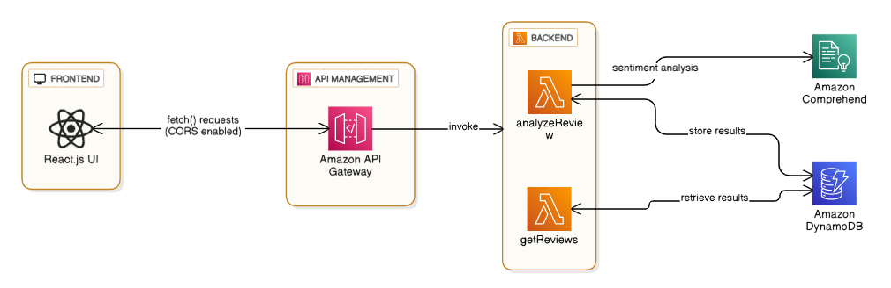

# 🧠 AI-Powered Product Review Analyzer

An intelligent, serverless web application that analyzes customer product reviews using **AWS Comprehend** to extract **sentiment** (Positive, Negative, Neutral, Mixed) and **key phrases**. The app provides a clean dashboard for visualizing sentiment trends and insights — built with a fully serverless AWS architecture and a modern React frontend.



---

## 🚀 Features

- 🗣 **AI-Powered Sentiment Analysis** using AWS Comprehend
- ☁️ **Serverless Backend** with AWS Lambda, API Gateway, and DynamoDB
- 📊 **Interactive Dashboard** for visualizing sentiment distribution
  
---

## 🧰 Tech Stack Summary

| Layer | Technology | Description |
|-------|-------------|-------------|
| **Frontend** | React (hosted on Vercel) | User interface for submitting and viewing reviews |
| **API Layer** | AWS API Gateway | Manages REST API endpoints |
| **Compute** | AWS Lambda (Node.js) | Processes review text and handles data retrieval |
| **AI / NLP** | AWS Comprehend | Performs sentiment & key phrase extraction |
| **Database** | AWS DynamoDB | Stores review text, sentiment, and analysis results |
| **Logging** | AWS CloudWatch | Monitors Lambda executions and errors |
| **Auth & Permissions** | AWS IAM | Manages secure access between AWS services |

---

## ⚙️ Architecture Overview

The system follows a **serverless and event-driven architecture** using AWS services.

### 🧱 Architecture Diagram

The architecture diagram above illustrates the complete data flow:

**Frontend Layer:**
- React App with multiple UI states (Loading, Error, Empty, Result)
- Dashboard with filters, sentiment chart, and review list
- Optional features: Search, pagination, CSV export, dark mode
- Review Form for user input

**AWS Cloud Environment:**
- **API Gateway**: Entry point for all HTTP requests
- **Lambda Functions**: 
  - `analyzeReview`: Processes POST requests for sentiment analysis
  - `getReviews`: Handles GET requests for retrieving stored reviews
- **AWS Comprehend**: AI service for sentiment and key phrase extraction
- **DynamoDB**: NoSQL database storing ProductReviews data
- **CloudWatch**: Centralized logging and monitoring
- **IAM Role**: Secure permissions management

---

### 🧩 Architecture Summary

The AI-Powered Product Review Analyzer follows a fully serverless architecture using AWS services. A React frontend communicates with AWS API Gateway endpoints that invoke Lambda functions for sentiment analysis and data retrieval. Reviews are processed through AWS Comprehend for sentiment and key phrase extraction, stored in DynamoDB, and visualized on an interactive dashboard with real-time analytics and user feedback states.

---

## 📂 Project Structure

```
AI-POWERED-PRODUCT-REVIEW-ANALYZER/
│
├── ai-product-review-analyzer/
│   ├── node_modules/
│   ├── public/
│   └── src/
│       └── assets/
│           └── react.svg
│
├── App.css
├── App.jsx
├── main.jsx
├── index.html
│
├── .gitignore
├── eslint.config.js
├── package-lock.json
├── package.json
├── README.md
├── vite.config.js
│
├── backend/
│   ├── analyzeReview-sam.yml
│   ├── analyzeReview.zip
│   ├── getReviews.yml
│   └── getReviews.zip
│
└── Notes/
    ├── APIURLs.txt
    └── README.md
```

---

## 🔧 Setup and Deployment

### **Frontend Setup (React)**

```bash
cd ai-product-review-analyzer
npm install
npm start
```
## 🌟 Future Enhancements

- 🔔 **Email notifications** using AWS SES for weekly sentiment summaries
- 📦 **S3 storage integration** for storing exported reports
- 🧠 **Multi-language support** with Comprehend language detection
- 🔐 **Authentication** using AWS Cognito for admin dashboard access
- 📈 **Advanced analytics** with trend analysis over time
- 🤖 **Automated responses** to negative reviews using AI

---

## 👩‍💻 Author

**Nivi Jha**

- 🌐 [GitHub](https://github.com/nivi-jha)
- 💼 [LinkedIn](https://linkedin.com/in/nivi-jha)

---

## 📄 License

This project is licensed under the **MIT License** — you are free to modify and use it for learning and portfolio purposes.

---
